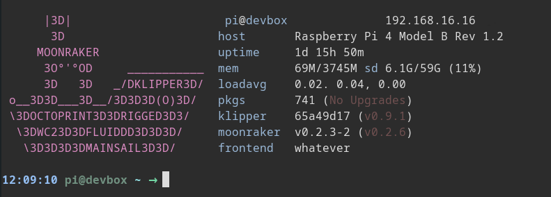

# rigfetch
---

**rigfetch** is a little script like [pfetch](https://github.com/dylanaraps/pfetch)
for raspian based distros like:

- [MainsailOS](https://github.com/raymondh2/MainsailOS)
- [FluiddPI](https://github.com/cadriel/FluiddPI)
- [OctoPI](https://github.com/guysoft/OctoPi)

## What it should do ( mostly it does :) )

>for sure it's not my real IP :)

### TODO:

- Documentation
- Installer Script
- Credits
- and much more

Till it has an Installer script simply do:

`git clone https://github.com/KwadFan/rigged.git`

for simplicity make an link to script with:

`ln -s path/to/rigfetch.sh /usr/bin/rigfetch`

>Set path/to/rigfetch.sh according to your path, usually /home/pi/rigged/rigfetch.sh

*This project is heavily under cunstruction, so, please be patient*

---
## Credits

### Credits and a big Thank You to...
- **th33xitus**
    - for (unknowingly, sorry mate :) ) contributing some  code from his great "KIAUH" Suite
    - [https://github.com/th33xitus/kiauh](https://github.com/th33xitus/kiauh)

- **Raymond Himle**
    - for [MainsailOS](https://github.com/raymondh2/MainsailOS)

- **meteyou**
    - [mainsail](https://github.com/meteyou/mainsail) Fronend for Klipper/Moonraker

- **Arksine**
    - for making all this possible the great:
    - [Moonraker API](https://github.com/Arksine/moonraker)

- **KevinOConnor**
    - the reason why we can use all this stuff:
    - [klipper](https://www.klipper3d.org)

- and last but not least, all other contributors that helped to make all this possible!
